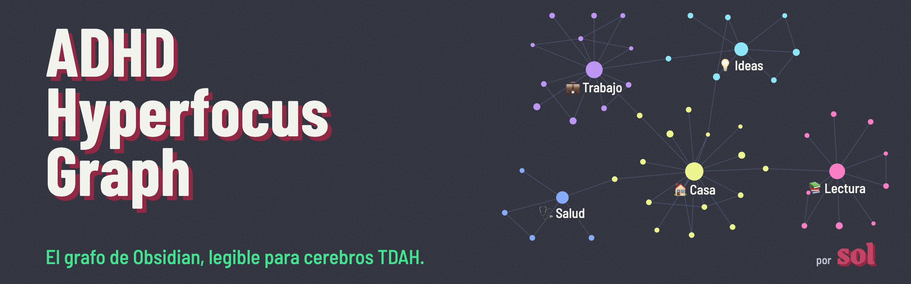
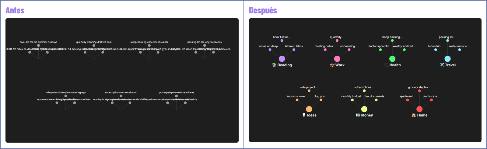
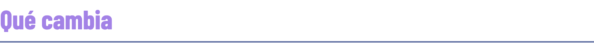
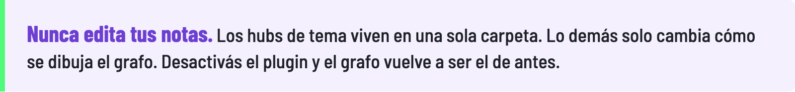
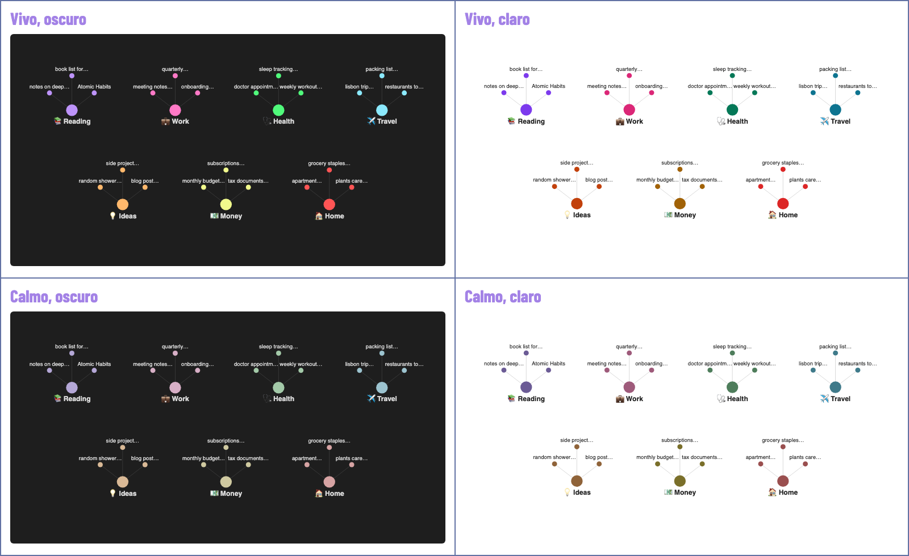
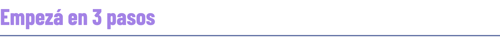
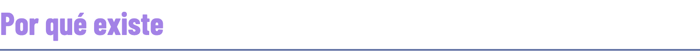
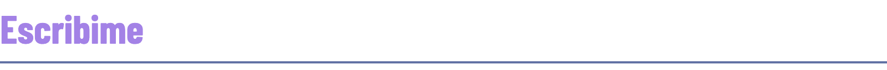

<a href="README.md">English</a> · <b>Castellano</b>

La [vista de grafo](https://obsidian.md/help/plugins/graph) de [Obsidian](https://obsidian.md) muestra el nombre entero de cada archivo, no deja de moverse y agrupa las notas por carpeta. Pasadas unas cientos de notas se vuelve una pared de texto.

Este plugin mantiene el grafo que ya tenés y lo vuelve lo bastante tranquilo como para pensar con él.

Ilustraciones con notas inventadas.

<h3></h3>

🔭 **Poco texto con cualquier zoom.** De lejos ves solo los nodos principales: tus temas, o las notas con más conexiones. Al acercarte a un grupo, cada nota muestra una etiqueta corta. El zoom que muestra todas las etiquetas se ajusta al tamaño del vault, así nunca se llena de texto.

🖱️ **El nombre completo, con un hover.** Pasás el mouse por cualquier nodo y muestra el nombre entero del archivo. No se pierde nada.

🧲 **Un hub por tema.** Vos definís tus temas. Cada uno tiene una nota hub que enlaza sus notas, y se agrupan por lo que tratan, no por carpeta.

🌙 **Un layout tranquilo.** Las notas de sistema salen del grafo, las etiquetas quedan visibles y la simulación se frena cuando los nodos se acomodan.

🎨 **Tus colores.** Dos paletas, Dopamine y Quiet mode. Claro u oscuro sigue tu tema. Hay una paleta para daltonismo.

<picture>
  <source media="(prefers-color-scheme: dark)" srcset="images/never-edits-es-dark.png">
  
</picture>

<h3></h3>

<h3></h3>

1. Instalá y activá el plugin desde [Community plugins](https://obsidian.md/help/community-plugins).
2. Elegí Dopamine o Quiet mode, y marcá las carpetas que para vos son temas.
3. Abrí el grafo.

Con el comando **Abrir el arranque en 3 pasos** lo volvés a ver. Todo aparece en castellano si Obsidian está en castellano.

<b>✂️ Cómo se acorta un nombre</b>

- Las fechas se van: `handoff-2026-10-06-notas-reunion` se ve como `notas reunion`.
- "Título - Autor" deja el título: `Nuestra parte de noche - Mariana Enríquez` se ve como `Nuestra parte…`, y el título entero aparece con un hover.
- Los nombres largos se cortan en una palabra entera y terminan en `…`.
- Dos notas con el mismo nombre llevan la carpeta que las distingue: `trabajo·README`, `casa·README`.
- ¿Querés una etiqueta en particular? Agregale a la nota la [propiedad](https://obsidian.md/help/properties) `label`. Siempre gana.

Ajustes: largo máximo de la etiqueta (de 8 a 30 caracteres) y tamaño (de 1x a 2x el de Obsidian).

<b>🧲 Cómo encuentra cada nota su hub</b>

Cada tema tiene un nombre, un emoji y hasta tres reglas. Una nota entra en un tema cuando cumple cualquiera:

- **Carpetas:** la nota está dentro de una de estas carpetas.
- **Palabras del título:** palabras enteras, sin importar los acentos.
- **Etiquetas:** la nota tiene esta etiqueta o una anidada debajo.

Una nota puede estar en dos temas como máximo. Los hubs se regeneran cuando cambian las notas, así que no escribas adentro.

La barra de estado muestra cuántas notas no tienen tema todavía. Con un click le asignás tema a cada una.

<b>⌨️ Comandos</b>

- **Aplicar el layout tranquilo al grafo**
- **Actualizar las notas de tema**
- **Enfocar un tema:** abre ese tema solo, en un [grafo local](https://obsidian.md/help/plugins/graph). También está en la barra lateral (el ícono de diana).
- **Prender o apagar las etiquetas cortas**
- **Ver notas sin tema**
- **Abrir el arranque en 3 pasos**

Ningún comando trae atajo de teclado. Agregá los tuyos en Ajustes, [Atajos de teclado](https://obsidian.md/help/hotkeys).

<b>🙈 Notas ocultas</b>

De entrada el grafo oculta las notas llamadas `GATES*`, `CLAUDE`, `AGENTS`, `README`, `handoff-*` y `prompt-*`: archivos que las herramientas y los asistentes de IA escriben para sí mismos. La lista se edita en los ajustes. Las notas ocultas siguen en tu vault y en la búsqueda.

<b>⚠️ Para tener en cuenta</b>

- Las etiquetas cortas y el grafo quieto usan partes de Obsidian que están fuera de la [API pública](https://docs.obsidian.md). Una actualización futura de Obsidian podría romperlas. Si pasa, el plugin las apaga y el grafo sigue andando.
- Aplicar el layout tranquilo reemplaza el filtro, los grupos y las fuerzas del grafo. La configuración anterior no se guarda.
- Probado en Obsidian 1.14.4, escritorio. [Changelog](https://obsidian.md/changelog/).

<h3></h3>

🌐 **Nada sale de tu dispositivo.** Sin conexiones de red, sin telemetría, sin analytics, sin cuenta.

📖 **Qué lee:** nombres de archivo, carpetas, etiquetas y la propiedad `label`, a través del índice propio de Obsidian. Nunca lee el texto de tus notas.

✍️ **Qué escribe:** los hubs de tema, dentro de la única carpeta que elijas, y su propio archivo de ajustes en la carpeta del plugin. Si tenés una nota con el mismo nombre que un hub, no se toca nunca.

⚠️ **Para tener en cuenta:** los hubs enlazan tus notas por nombre, y el archivo de ajustes guarda las rutas de las notas que asignás a un tema a mano. Si publicás o compartís tu vault (con [Obsidian Publish](https://obsidian.md/publish) o un repo público), se van con él.

<h3></h3>

Necesitaba una forma mejor de ordenar mi segundo cerebro. El grafo tenía que mostrarme el panorama, y me mostraba ruido. No había nada hecho para un cerebro que funciona como el mío.

Así que lo armé.

<h3></h3>

¿Encontraste un bug? ¿Se te ocurrió algo? ¿El grafo se ve raro en tu vault? ¡Avisame!

- 🐛 [Abrí un issue](https://github.com/missyeahhh/adhd-hyperfocus-graph/issues): reportes de bugs, pedidos de features, preguntas.
- 💬 [Escribime por LinkedIn](https://www.linkedin.com/in/soldr): feedback, o cómo encaja en tu workflow.

---

🎨 Hecho por [Soledad De Rosa](https://www.linkedin.com/in/soldr). Construido con [Claude Code](https://claude.com/claude-code). Licencia MIT.
