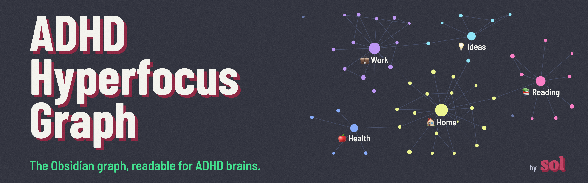
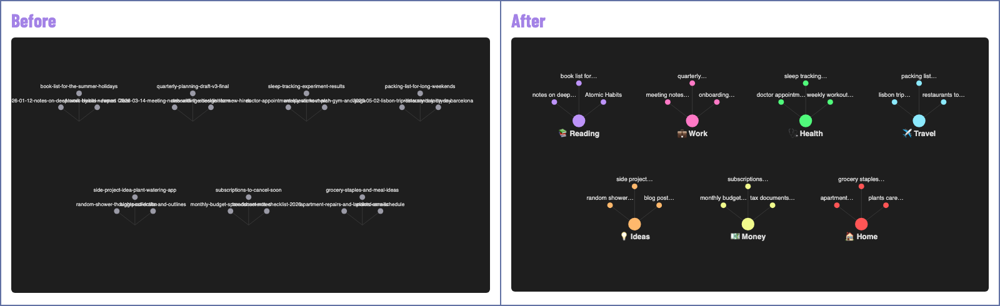
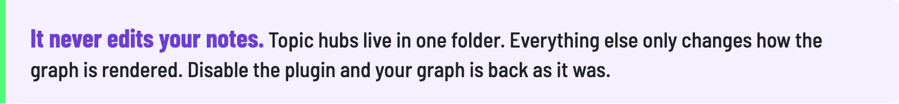
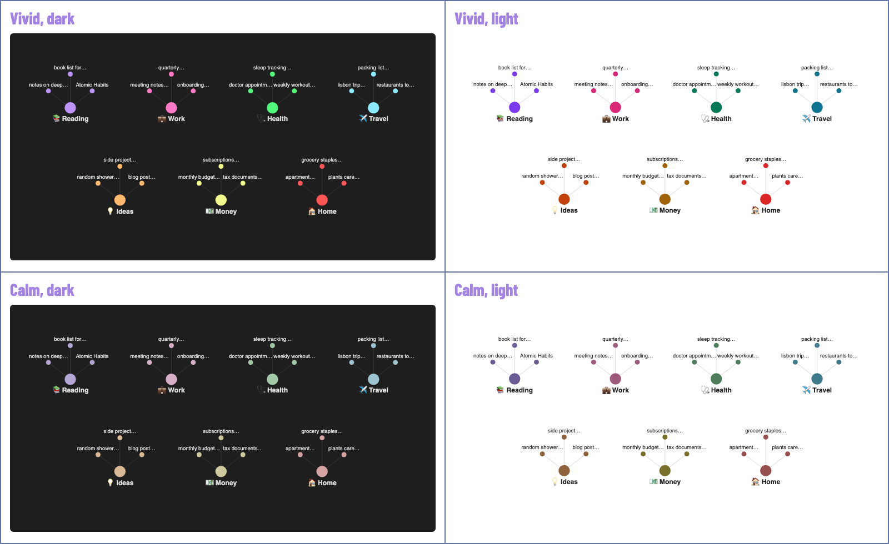

<b>English</b> · <a href="README.es.md">Castellano</a>

The core [Obsidian](https://obsidian.md) [graph view](https://obsidian.md/help/plugins/graph) renders every file name in full, never stops moving and clusters notes by folder. Past a few hundred notes it turns into a wall of text.

This plugin keeps the graph you already have and makes it calm enough to think with.

Illustrations with made-up notes.

<h3></h3>

🔭 **Little text at any zoom.** From afar you only see the main nodes: your topics, or your most connected notes. Zoom into a cluster and each note gets a short label. The zoom level that shows every label scales with vault size, so the picture never fills with text.

🖱️ **The full name is one hover away.** Hover any node and it shows the complete file name. Nothing gets lost.

🧲 **One hub per topic.** You define your topics. Each one gets a hub note that links its notes, so they cluster by meaning, not by folder.

🌙 **A calm layout.** System notes leave the graph, labels stay visible, and the simulation stops once the nodes settle.

🎨 **Your colors.** Two palettes, Dopamine and Quiet mode. Light or dark follows your theme. There is also a palette for color blindness.

<picture>
  <source media="(prefers-color-scheme: dark)" srcset="images/never-edits-en-dark.png">
  
</picture>

<h3></h3>

<h3></h3>

1. Install and enable the plugin from [Community plugins](https://obsidian.md/help/community-plugins).
2. Pick Dopamine or Quiet mode, tick the folders that are topics for you.
3. Open the graph.

Run the command **Open the 3-step setup** to see it again.

<b>✂️ How a name gets short</b>

- Dates go: `handoff-2026-10-06-meeting-notes` shows as `meeting notes`.
- "Title - Author" keeps the title: `Our Share of Night - Mariana Enriquez` shows as `Our Share of…`, and the full title is one hover away.
- Long names are cut at a whole word and end with `…`.
- Two notes with the same name get the folder that tells them apart: `work·README`, `home·README`.
- Want a specific label? Add a `label` [property](https://obsidian.md/help/properties) to the note. It always wins.

Settings: max label length (8 to 30 characters) and label size (1x to 2x the Obsidian size).

<b>🧲 How notes find their hub</b>

Each topic has a name, an emoji and up to three rules. A note joins a topic when any rule matches:

- **Folders:** the note is inside one of these folders.
- **Words in the title:** whole words, accents ignored.
- **Tags:** the note has this tag or a nested tag under it.

A note can be in two topics at most. Hub notes are regenerated when notes change, so do not write inside them.

The status bar shows how many notes have no topic yet. Click it to assign one to each.

<b>⌨️ Commands</b>

- **Apply the calm layout to the graph**
- **Update topic hubs**
- **Focus on one topic:** opens that topic alone, in a [local graph](https://obsidian.md/help/plugins/graph). Also on the ribbon (the target icon).
- **Turn short labels on or off**
- **Show notes without a topic**
- **Open the 3-step setup**

No command ships with a default hotkey. Add your own in Settings, [Hotkeys](https://obsidian.md/help/hotkeys).

<b>🙈 Hidden notes</b>

By default the graph hides notes named `GATES*`, `CLAUDE`, `AGENTS`, `README`, `handoff-*` and `prompt-*`: files that tools and AI assistants write for themselves. Edit the list in the settings. Hidden notes stay in your vault and in search.

<b>⚠️ Good to know</b>

- Short labels and the still graph use parts of Obsidian outside the [public API](https://docs.obsidian.md). A future Obsidian update could break them. If that happens, the plugin turns them off and your graph keeps working.
- Applying the calm layout replaces the graph's filter, groups and forces. Your previous settings are not kept.
- Tested on Obsidian 1.14.4, desktop. [Changelog](https://obsidian.md/changelog/).

<h3></h3>

🌐 **Nothing leaves your device.** No network requests, no telemetry, no analytics, no account.

📖 **What it reads:** file names, folders, tags and the `label` property, through Obsidian's own index. It never reads the text of your notes.

✍️ **What it writes:** the topic hubs, inside the one folder you choose, and its own settings file in the plugin folder. A note of yours with the same name as a hub is never touched.

⚠️ **Worth knowing:** hubs link to your notes by name, and the settings file keeps the paths of the notes you assign to a topic by hand. If you publish or share your vault (with [Obsidian Publish](https://obsidian.md/publish) or a public repo), they go with it.

<h3></h3>

I needed a better way to organize my second brain. The graph was supposed to show me the big picture, and it showed me noise. Nothing out there was built for a brain that works like mine.

So I built it.

<h3></h3>

Found a bug? Got an idea? Does the graph look weird in your vault? Let me know!

- 🐛 [Open an issue](https://github.com/missyeahhh/adhd-hyperfocus-graph/issues): bug reports, feature requests, questions.
- 💬 [Message me on LinkedIn](https://www.linkedin.com/in/soldr): feedback, or how it fits your workflow.

---

🎨 Made by [Soledad De Rosa](https://www.linkedin.com/in/soldr). Built with [Claude Code](https://claude.com/claude-code). MIT license.
