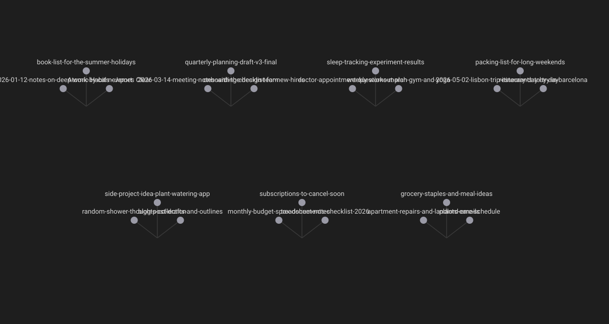
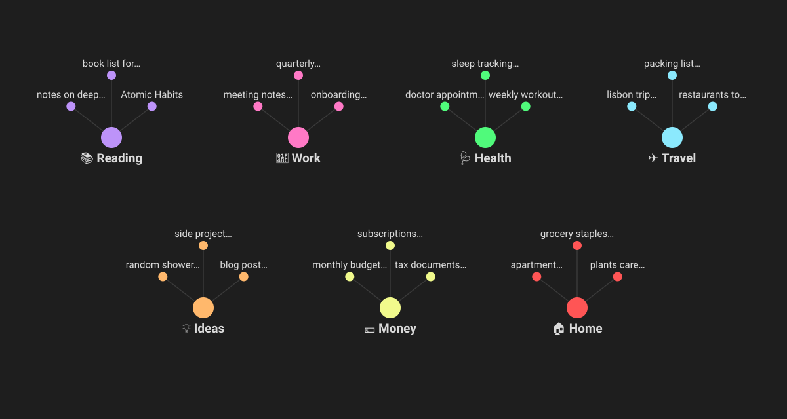

# ADHD Hyperfocus Graph

The Obsidian graph, made readable for ADHD and dyslexic brains.

The core graph shows every file name in full, moves all the time and groups notes by folder. With a few hundred notes it turns into a wall of text. This plugin keeps the graph you already have and changes four things:

- **Little text at any zoom.** From afar you see only your topic names, big. Zoom into a cluster and each note shows a short name of 16 letters or fewer. No hovering.
- **One hub per topic.** You say what your topics are. Each one gets a hub note that links its notes, so they cluster by meaning, not by folder.
- **A calm layout.** System notes leave the graph, text stays visible, and the dots stop moving once they settle.
- **Two palettes.** Vivid or Calm. Light or dark follows your theme. There is also a palette for color blindness.

**It never edits your notes.** Topic hubs live in one folder. Everything else only changes how the graph is drawn. Turn the plugin off and your graph is back as it was.

| Before | After |
|---|---|
|  |  |

Illustrations with made-up notes. Light theme: [images/after-light.svg](images/after-light.svg). Calm palette: [images/calm-dark.svg](images/calm-dark.svg).

[Leer en castellano](#en-castellano)

## Start

1. Install and enable the plugin.
2. A 3-step setup opens: pick Vivid or Calm, tick the folders that are topics for you, done.
3. Open the graph.

You can open the setup again with the command **Open the 3-step setup**.

<b>Short labels: how a name gets short</b>

- Dates go: `handoff-2026-10-06-meeting-notes` shows as `meeting notes`.
- "Title - Author" keeps the title: `Ideario - Enrique Malatesta` shows as `Ideario`.
- Long names are cut at a whole word and end with `…`.
- Two notes with the same name (two `README`) get the folder that tells them apart: `work·README`, `home·README`.
- Want a specific label? Add a `label` property to the note. It always wins.

Settings: longest label (8 to 30 letters) and label size (1 to 2 times the Obsidian size).

<b>Topics: how notes find their hub</b>

Each topic has a name, an emoji and up to three rules. A note joins a topic when any rule matches:

- **Folders:** the note is inside one of these folders.
- **Words in the title:** whole words, accents ignored.
- **Tags:** the note has this tag or a tag under it.

A note can be in two topics at most. The hub notes are rewritten when notes change, so do not write inside them.

The status bar shows how many notes have no topic yet. Click it to give each one a topic.

<b>Commands</b>

- **Apply the calm layout to the graph**
- **Update topic hubs**
- **Focus on one topic:** opens that topic alone, in a local graph. Also on the ribbon (the target icon).
- **Turn short labels on or off**
- **Show notes without a topic**
- **Open the 3-step setup**

No command has a default hotkey. Add your own in Settings, Hotkeys.

<b>Hidden notes</b>

By default the graph hides notes named `GATES*`, `CLAUDE`, `AGENTS`, `README`, `handoff-*` and `prompt-*`: files that tools and assistants write for themselves. Change the list in the settings. Hidden notes stay in your vault and in search.

<b>Good to know</b>

- Short labels and the still graph use parts of Obsidian that are not a public API. A future Obsidian update could break them. If that happens, the plugin turns them off and your graph keeps working.
- Applying the calm layout replaces the graph's filter, groups and forces. Your old settings are not kept.
- Tested on Obsidian 1.14.4, desktop.

## En castellano

El grafo de Obsidian, legible para cerebros con TDAH y dislexia.

- **Poco texto con cualquier zoom:** de lejos ves solo los nombres de tus temas, grandes. Al acercarte a un grupo, cada nota muestra un nombre corto de 16 letras o menos. Sin pasar el mouse.
- **Una nota por tema:** cada tema tiene una nota que enlaza sus notas, y se agrupan por lo que tratan, no por carpeta.
- **Layout tranquilo:** las notas de sistema salen del grafo, el texto queda visible y los puntos dejan de moverse.
- **Dos paletas:** Vivo o Calmo. Claro u oscuro sigue tu tema. Hay una paleta para daltonismo.

**Nunca edita tus notas.** Las notas de tema viven en una sola carpeta. Lo demás solo cambia cómo se dibuja el grafo.

Para empezar: instalalo, seguí los 3 pasos (Vivo o Calmo, tus temas, listo) y abrí el grafo. Todo está en castellano si Obsidian está en castellano.

## License

MIT
